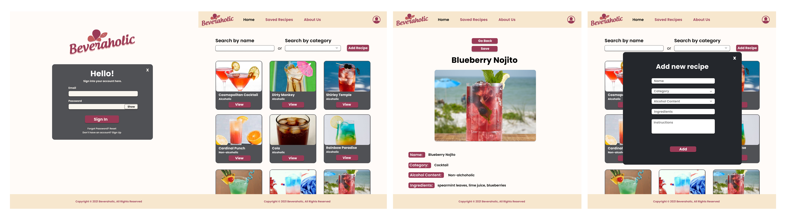
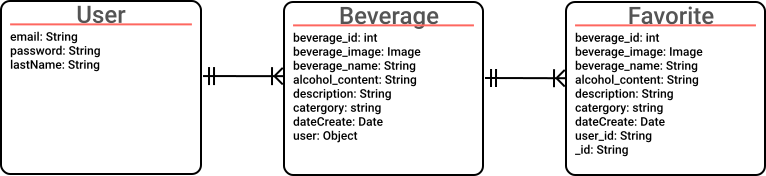

## 
 

## 
 🔠Description ğŸ”

Beveraholic is an enjoyable web application that allows users to add and find their favorite alcoholic/non-alcoholic beverages. Users will be able to pick and make the most popular and tastiest drinks in the world. Each beverage item will have an image, name, and alcoholic content level as well as a view button with preparation steps. 

  Please be adviced to drink responsible for the alcoholic beverages.

## 
 🛠 Wireframing 🛠 

| Logo                                                         |                                                              |
| ------------------------------------------------------------ | ------------------------------------------------------------ |
|  |
| logo                                                         |

| Fonts                                                              |
| ------------------------------------------------------------------ |
|  |

| Mockups                                                                            |                                                                                  |                                                                                         |
| ---------------------------------------------------------------------------------- | -------------------------------------------------------------------------------- | --------------------------------------------------------------------------------------- |
|  |  |  |
| Desktop                                                                            | Tablet                                                                           | Mobile                                                                                  |

## 
 🖇 Component Hierarchy 🖇  

|  |
| ----------------------------------------------------------------------------------------------- |
| component hierarchy                                                                             |

## 
 🖇 Entity Relation Diagram 🖇  

|  |
| ----------------------------------------------------------------------------------------------- |
| Entity Relation Diagram                                                                            |

## 
 🗄 Client 🗄 

> - React
> - React Hooks Implementation
> - Axios
> - Redux Toolkit
> - Tailwind CSS

## 
 🗄 Server 🗄 

> - Express
> - MongoDB
> - Mongoose
> - Passport 
> - Morgon

## 
 🆠MVP ğŸ†

> - Login/Logout
> - Add new beverage recipe
> - Search beverages by name
> - Search beverages by category
> - Upload image of beverage

## 
 🔮 Post-MVP 🔮 

> - Saving Favorite Beverage to Local Storage
> - Likes and dislikes button

## 
 📠 Contact 📠

| David Espinal | Katherine Fernandez | Shan Siddiqui | Angel B. Fernandez
| --------------------------------------------------------------------------------------------------------------------------------------------------------------------------------- | -------------------------------------------------------------------------------------------------------------------------------------------------------------------------------- | ------------------------------------------------------------------------------------------------------------------------------------------------------------------------------------ | --------------------------------------------------------------------------------------------------------------------------------------------------------------------------------- |
|   |   |   |  
|                                                                                                                                                                                   |                                                                                                                                                                                  |                                                                                                                                                                                      |
